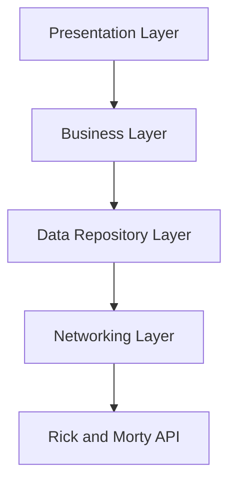

# Rick and Morty Character Viewer


## Table of Contents
1. [Project Overview](#project-overview)
2. [Architecture](#architecture)
3. [Modules](#modules)
4. [Key Features](#key-features)
5. [Getting Started](#getting-started)
6. [Development](#development)
7. [Testing](#testing)
8. [Dependency Management](#dependency-management)
9. [Coding Standards](#coding-standards)
10. [Performance Considerations](#performance-considerations)
11. [Future Improvements](#future-improvements)
12. [Contributing](#contributing)
13. [License](#license)

## Project Overview

The Rick and Morty Character Viewer is an iOS application that showcases characters from the popular animated series "Rick and Morty". It utilizes the [Rick and Morty API](https://rickandmortyapi.com/) to fetch and display character information in a user-friendly interface.

### High-Level Architecture Diagram



## Architecture

The project follows Clean Architecture principles, utilizing the MVVM-C (Model-View-ViewModel-Coordinator) pattern in the presentation layer. It's designed with modularity in mind, separating concerns into distinct layers:

1. **Presentation Layer (RickCompanion)**: Implements the user interface and handles user interactions.
2. **Domain Layer (BusinessLayer)**: Contains the core business logic and use cases.
3. **Data Layer (DataRepository)**: Abstracts the data sources and provides a clean API for the domain layer.
4. **Networking Layer (APIGate)**: Handles all network communications.
5. **Common**: Provides shared utilities and extensions used across the application.

## Modules

### 1. APIGate
- Responsible for network communication
- Implements `URLSessionNetworking`
- Defines network protocols and endpoints
- Handles network errors

### 2. DataRepository
- Abstracts data sources
- Implements `CharacterRepository`
- Defines Data Transfer Objects (DTOs)
- Handles data-related errors

### 3. BusinessLayer
- Implements use cases (e.g., `FetchCharactersUseCase`)
- Defines business logic and rules
- Handles business-related errors

### 4. RickCompanion (Main App)
- Implements the MVVM-C pattern
- Contains scenes for character list and details
- Implements coordinators for navigation
- Defines ViewModels and ViewControllers

### 5. Common
- Provides shared utilities (e.g., image loading and caching)
- Implements common UI components
- Contains extensions and helper functions

## Key Features
- Paginated list of Rick and Morty characters
- Character filtering by status (Alive, Dead, Unknown)
- Detailed view for each character
- Asynchronous image loading with caching
- Dark mode support

## Getting Started

### Prerequisites
- Xcode 13.0+
- iOS 16.0+
- Swift 5.5+

### Installation
1. Clone the repository:
   ```bash
   git clone https://github.com/yourusername/rick-and-morty-viewer.git
   ```
2. Open `RickCompanion.xcodeproj` in Xcode.
3. Build and run the project on your simulator or device.

## Development

### Project Structure
```
RickCompanion/
├── APIGate/
│   ├── NetworkLayer/
│   ├── Protocols/
│   └── Utilites/
├── DataRepository/
│   ├── Repositories/
│   ├── DTOs/
│   └── Endpoints/
├── BusinessLayer/
│   └── UseCases/
├── RickCompanion/
│   ├── Presentation/
│   │   ├── Scenes/
|   |   ├── Common/
│   │   └── Coordinator/
│   └── App/
└── Common/
    ├── Utilities/
    └── Extensions/
```

### Adding a New Feature
1. Determine which module(s) will be affected.
2. Implement necessary data structures in DataRepository if required.
3. Add business logic in BusinessLayer if needed.
4. Implement the UI in the RickCompanion module.
5. Update coordinators if the feature requires navigation changes.
6. Update Dependency Injection Containers to create new instance.
7. Add appropriate unit tests for all new components.

## Testing

Each module has its own test target. To run tests:

1. Select the desired scheme (e.g., `APIGateTests`, `DataRepositoryTests`, etc.)
2. Press `Cmd+U` or navigate to Product > Test

Ensure that you maintain high test coverage, especially for business logic and data handling.

## Dependency Management

The project uses Swift Package Manager for dependency management. To add a new dependency:

1. In Xcode, go to File > Swift Packages > Add Package Dependency
2. Enter the repository URL and follow the prompts


## Performance Considerations

- Implement efficient image caching to reduce network requests
- Use pagination for character list to optimize memory usage
- Implement proper error handling and retry mechanisms for network requests
- Optimize UI for smooth scrolling and responsive user interactions

## Future Improvements

- Implement search functionality for characters
- Add favorite character feature with local storage
- Introduce episode list and details
- Implement UI State Restoration
- Add localization for multiple languages
- Enhance accessibility features

## Contributing

We welcome contributions! Please follow these steps:

1. Fork the repository
2. Create your feature branch: `git checkout -b feature/AmazingFeature`
3. Commit your changes: `git commit -m 'Add some AmazingFeature'`
4. Push to the branch: `git push origin feature/AmazingFeature`
5. Open a Pull Request

Please ensure your code adheres to our coding standards and includes appropriate tests.

## License

This project is licensed under the MIT License - see the [LICENSE.md](LICENSE.md) file for details.

---

For any questions or support, please open an issue in the GitHub repository or contact the maintainers directly.
